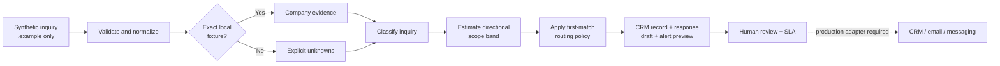

# RoutePilot

RoutePilot turns a synthetic inbound inquiry into an explainable next action: it matches local company evidence, classifies the request, estimates a directional project-scope band, selects a representative, and prepares reviewable CRM, response, and team-alert artifacts. Every decision exposes its rule and limitation, and nothing is sent outside the browser.

**Live demo:** [prasiddhakarki.online/work/inbound-lead-routing](https://prasiddhakarki.online/work/inbound-lead-routing)

> This is a deterministic, human-gated portfolio prototype—not a deployed lead-processing system. It accepts only fictional contact details and reserved `.example` domains.

## What it demonstrates

- Six visible stages from validated intake to human review.
- Exact-match enrichment for three synthetic companies, with unknown fields preserved when no fixture matches.
- Inspectable keyword classification across evaluation, automation, product, advisory, and general discovery.
- Directional scope bands derived from stated company size and inquiry category—not a quote, budget, close probability, or revenue forecast.
- Ordered, first-match routing with the winning rule and reason shown to the reviewer.
- Local CRM JSON download, personalized response draft, and team-alert preview.
- A three-state, 60-second human-review SLA simulator.
- Keyboard focus states, reduced-motion support, and a responsive mobile layout.

## Decision flow



The dashed edge is an integration seam, not an implemented transmission path.

## Routing logic

Classification checks category rules in this order: evaluation, automation, product, then advisory. A rule matches visible whole-word keywords (or an explicit multiword phrase); if none match, the inquiry remains in general discovery.

The first matching owner rule wins:

| Priority | Condition | Owner | Team |
| --- | --- | --- | --- |
| 1 | Evaluation/safeguards inquiry or regulated fixture context | Priya Shah | Trust & Evaluation |
| 2 | Automation or product-build inquiry | Theo Martin | Solutions Engineering |
| 3 | Stated employee count is at least 500 | Amara Okafor | Enterprise Partnerships |
| 4 | No earlier rule matches | Maya Brooks | Growth & Discovery |

## Directional value logic

The estimate starts with a size-based scope range, multiplies both bounds by a category factor, and rounds to the nearest $1,000.

| Stated employees | Base scope range |
| --- | ---: |
| 1–20 | $4,000–$12,000 |
| 21–100 | $12,000–$30,000 |
| 101–500 | $25,000–$65,000 |
| 501+ | $60,000–$140,000 |

| Category | Factor |
| --- | ---: |
| Evaluation | 1.10× |
| Automation | 1.10× |
| Product | 1.15× |
| Advisory | 0.90× |
| General discovery | 0.75× |

This output describes possible project scope only. The model never treats it as price, available budget, purchase intent, conversion probability, or expected revenue.

## Fixture outcomes

| Synthetic scenario | Category | Directional scope | Route |
| --- | --- | ---: | --- |
| Northstar Fabrication · 420 employees | Workflow automation | $28,000–$72,000 | Theo Martin · Solutions Engineering |
| Flux Health Services · 85 employees | AI evaluation & safeguards | $13,000–$33,000 | Priya Shah · Trust & Evaluation |
| Atlas Logistics Group · 1,200 employees | General discovery | $45,000–$105,000 | Amara Okafor · Enterprise Partnerships |
| Unknown fixture · 12 employees | General discovery | $3,000–$9,000 | Maya Brooks · Growth & Discovery |

The focused suite currently passes **8/8 tests**, covering 3/3 known enrichment fixtures, 5/5 category fixtures, all four routing branches, all four size bands, deterministic preview artifacts, three mutually exclusive SLA states, accessibility markers, and the absence of outbound request paths.

## Safeguards

- **Synthetic-data boundary:** emails and domains must end in `.example`; users are explicitly told not to enter real contact data.
- **Unknown stays unknown:** unmatched domains do not trigger guessed research attributes.
- **Evidence over confidence theater:** the interface reports exact rule evidence or a visible fallback.
- **Preview-only outputs:** CRM, email, and alert artifacts can be copied or downloaded locally, but not delivered.
- **Zero hidden network calls:** the workflow model and component contain no `fetch`, form action, webhook, mail link, or messaging API path.
- **Required human gate:** the SLA tracks review time; marking an inquiry reviewed changes local browser state only.

## Stack

- Next.js 16 and React 19
- TypeScript 5.9
- Deterministic ESM JavaScript decision model
- CSS Modules
- Browser Clipboard and Blob APIs
- Node's built-in test runner
- Vinext/Vite runtime targeting Cloudflare in the source portfolio

## Run locally

This repository package is a focused route slice. Place the files at the paths in [`MANIFEST.md`](./MANIFEST.md) inside a compatible Next.js App Router project. The source portfolio uses Node.js 22.13 or newer and pnpm.

```bash
pnpm install
pnpm dev
```

Open [http://localhost:3000/work/inbound-lead-routing](http://localhost:3000/work/inbound-lead-routing).

Run only the RoutePilot tests:

```bash
node --test tests/inbound-lead-routing.test.mjs
```

In the source portfolio, the full validation command builds the application before running every test file:

```bash
pnpm test
```

## Production seams

The prototype deliberately leaves external adapters disconnected. A production implementation would need:

- **Structured classification:** schema-validated model output, explicit abstention, evaluation data, and versioned prompts or policies.
- **Research provider:** licensed sources, provenance, freshness controls, consent handling, and an unknown-data fallback.
- **CRM adapter:** least-privilege credentials, input validation, idempotency, retries, and auditable create/update behavior.
- **Email and team messaging:** explicit authorization, rate limits, delivery-state handling, audit logs, and approval before send.
- **Operations layer:** authentication, access controls, observability, retention policies, incident handling, and monitored human-review queues.

These seams are design targets, not claims about the current demo.
# ai-inbound-lead-routing
Explainable inbound lead research, classification, value estimation, sales routing, CRM preview, response drafting, and SLA tracking.
